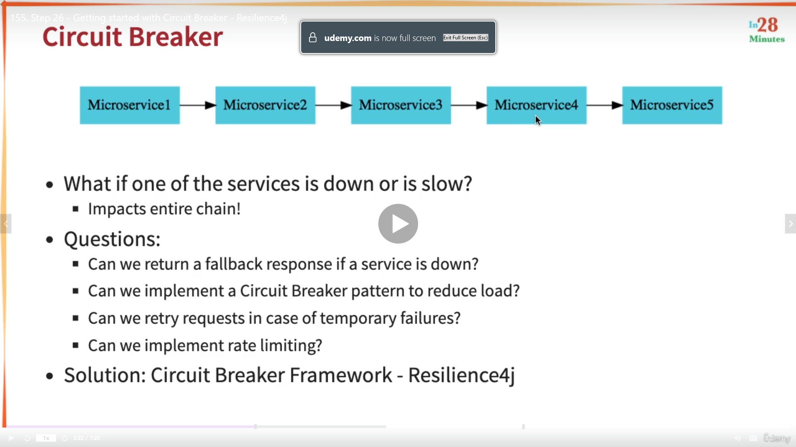
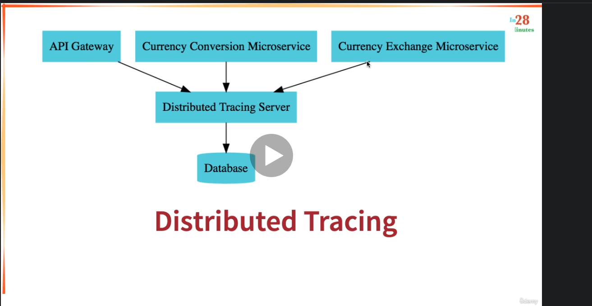

# microservicesrest
Repo for "Master Microservices with Spring Boot and Spring Cloud" from Udemy
Udemy Course "Master Microservices with Spring Boot and Spring Cloud"

RESTful Web Services Concepts
SOAP Web Services Concepts
Differences

- RESTful with  Spring Boot
- Spring Boot Auto Configuration and DispatcherServlet
- Bean Creation
- Service Creation
- GET,POST,PUT,DELETE,OPTIONAL
- Handle HTTP 4xx responses
- Handle Generic Exceptions
- Handle Resources
- HATEOAS (Hypermedia as the Engine of Application State)
- Internationalization i18n


HATEOAS
- Adding links to the response of a service to let the user which other action he can perform
  {
      "id": 1,
      "name": "Batman",
      "birthDate": "2021-10-11",
      "_links": {
      "all-users": {
        "href": "http://localhost:8080/users"
        }
      }
  }
  
Swagger using Springdoc OpenAPI 1.5.9
- OpenAPI = Specification
- Swagger = Tools for implementing the specification
- localhost:8080/swagger-ui.html


Spring Boot Actuator
- Monitoring the Application
- Health of the application
  localhost:8080/actuator

**JSON formatter extension in Chrome can help to read better the information of the Actuator 

HAL Explorer (JSON Hypertext Application Language)
- An easy way to hyperlink between resources in our API
- Provides an in-browser GUI to traverse the REST API
- localhost:8080

REST API Filtering
- A way to filter the data that you sent in the response without modifying the Bean, only filtering the Response
- @JsonIgnore
- @JsonIgnoreProperties --> Static Filtering

Dynamic Filtering
- @JsonFilter(<nameOfTheFilter>)

Versioning
- PersonV1
- PersonV2
- Name

Versioning (Header and Content Negotiation Approach)
- params
- headers (Headers in request)
- produces (Accept in headers)

** Depends of the type of versioning if can be executed in Browser, or generate Documentation, do a research considering the following factors

Factors to choose Versioning
- URI pollution
- Missuse of HTTP Headers
- Caching
- Can we Execute the request in the browser?
- API Documentation


Security with Spring Security (Basic Authentication, no OAuth or OAuth2)
- Once the dependency is added and the app started, search in the Console the following "Using generated security password: <xxxx...>"
- You will need the value in Postman to perform a Request, if you don't use it you will receive a HTTP 401 error
- Basic Auth
    - Username: user
    - Password: <xxx...>
- You can configure user and password in the .properties file
    - spring.security.user.name = username
    - spring.security.user.password = password
    
JPA
1) H2 database name is randomly generated each time you restart the server. You can find the database name and URL from the console log.

2) To use data.sql, you need to add this to application.properties -  spring.jpa.defer-datasource-initialization=true

e.g
spring.datasource.url=jdbc:h2:mem:testdb
spring.jpa.defer-datasource-initialization=true


To enable h2 console and perform queries on it.
spring.jpa.show-sql = true
spring.h2.console.enabled = true

localhost:8080/h2-console
jdbc:h2:mem:testdb


Tips for JPA Code
- When you create a relationship (@OneToMany,@OneToOne...) 
    - Example: "One User can have multiple Posts, but a Post is only from one User"
    - That Means @ManyToOne in Post class and @OneToMany in User class, but the owner of the relationship is Post
    - Then in User, you need to specify who is the Owner to not create the Relationship twice
    - You can do that in User using the keyword @OneToMany(mappedBy = "user") --> user is the name of the field in Post class that owns the relationship.


From IntelliJ console:
Hibernate: create table post (id integer not null, description varchar(255), user_id integer, primary key (id))
Hibernate: create table user (id integer not null, birth_date date, name varchar(255), primary key (id))

Post Table have a reference to User table with the id, but User table doesn't have a reference to Post Table, that's ok

- In Post Class added @JsonIgnore to user object
  - Because i don't want the details of the user when i get a specific post, not adding this could generate an infinite loop
    

Richardson Maturity Model (RMM)
- To evaluate/grade your RESTful API
- 4 stages, 3 Different Levels of Maturity (Level 0, Level 1, Level 2, Level 3)
    - Level 0: "Expose SOAP WEB Services in REST Style" --> Expose the URLs (e.g. http://server/getPosts,http://server/deletePosts...)
    - Level 1: "Expose Resources with proper URI" --> Group endpoints in resources (Users (/users), Posts (/posts)...)
    - Level 2: Level 1 + "Http Methods " --> Use proper HTTP method in a group of resources (GET, POST, PUT, DELETE, OPTIONAL)
    - Level 3: Level 2 + HATEOAS DATA + Next Possible Actions --> With HATEOAS we return what are the next possible actions after perform an action.
    

Best Practices in RESTful services design
- Consumer First
    - Simple name are better
    - Document your API, think in the Consumer of your API
- Make Best use of HTTP
    - Request Methods (GET, POST, PUT, DELETE)
    - Responses (1xx - Info , 2xx - Successful, 3xx - Redirection, 4xx - Client Error, 5xx - Server Error)
- No secure info in the URI (Uniform Resource Identifier)
- Always use plurals 
    - /users instead of /user
        /users/1 instead of /user/1
    - /posts instead of /post
- Use nouns for Resource
- Define a Consistent approach
    

Microservices
- "Small autonomous services that work together"
- Small deployable units
- Cloud enable (Optional)
    - Could have more than one instance for each one of them.
    - High availability
    
- Challenges
    - Stablish boundaries for each microservice
        - Probably you won't get that the first time you define one,
    - Configuration Management
        - 10 Microservices in 5 environments means 50 Microservices (A lot of support work)
    -  Dynamic Scale up and Scale Down (Dynamic load balance)
        - The load of work in the different services could change over the time, you could need 4 instances of a microservice to balance the load of work
    - Visibility
        - How to identify a bug?, we need to be able to indentify a down service, monitoring activity and logs.
    - Pack of Cards
        - A Service calling another service could be like a pack of cards, one over the other and then, if an important one falls, all the app is broken, failure tolerance.

Microservices with Spring Cloud

- Provides solutions to the challenges above.
- Different tools to quickly build some of the common patterns in distributed systems
- Spring Cloud contains more than one project related to the Cloud
    - Spring Cloud Netflix
        - Eureka
        - Hystrix
        - Zuul
    
    - Version used Finchley M2

- SpringCloudConfigServer
    - Centralize the configuration for all the microservices and expose it
    - Easy to maintain
    

For "Dynamic Scale Up and Scale Down"
    - Naming Server (Eureka)
    - Load Balancer
        - Ribbon for V2.3.0 or Earlier of Spring Boot (Client Side Load Balancing)
        - Spring Cloud LoadBalancer is the latest 
    - Feign (Easier REST Clients)


Example: 

- We have a service called "CurrencyCalculationService" that talks with the CurrencyExchangeService.
- We have three instances of CurrencyExchangeService (CurrencyExchangeService1, CurrencyExchangeService2, CurrencyExchangeServic3).
- We register all the services in the Naming Server (Eureka)
    - Register all microservices
    - Discovery of Services
- Then, the CurrencyCalculationService says to the Naming Server "Hey, give me the current instances of "CurrencyExchangeService"
- The Naming Server provides the three instances, Ribbon provides the load balancing


For "Visibility and Monitoring"
    - Zipkin Distributed Tracing
        - If a request has an ID, we can trace that request across multiple components using Zipkin
    - Netflix API Gateway
        - The microservices have a lot of common features... security, login, analytics...etc
        - Instead if implement them in each of the services, we can use Zuul API Gateway to do it.
            - Spring Cloud Gateway instead of Zuul for Spring Boot 2.4.0 or newer

For "Fault Tolerance"
    - Hystrix, if a service is down, Hystrix can provide a default Response.
        - Resilience4j instead of Hystrix for Spring Boot 2.4.0 or newer


Advantages of Microservices.
    - Flexibility to use different technologies in each one of te Microservices
        - Microservice 1 in Java
        - Microservice 2 in NodeJS
        - Microservice 3 in Kotlin
        - Microservice 1 in another language.
    - Dynamic Scaling
        - If your application has a season with a lot of traffic (e.g. Amazon in Christmas)
        - You can Scale Up or Scale Down based on the load
    -  Faster Release Cycles.


Docker "Contenarize Microservices"
    - Run microservices using Docker and Docker Compose

Kubernetes
    - Orchestrate all the Microservices with Kubernetes.


Material from Udemy Course for the Spring Cloud part
https://github.com/in28minutes/course-material/blob/main/01-spring-microservices/v2/downloads.md


************* MICROSERVICES PART **************
limits-service 
Is a microservice created appart from this project and is a complement of this one.
 - https://github.com/hugotb88/limits-service
 - Version 2.5.6
 - Spring Web
 - Spring Boot Dev Tools
 - Spring Boot Actuator
 - Spring Cloud Config  (Config Client)


spring-cloud-config-server project
Spring Config Server
 - https://github.com/hugotb88/spring-cloud.config-server
 - Version 2.5.6
 - Spring DevTools
 - Spring Config Server

currency-exchange-service project
IS a microservice created using Spring Initialzr for currency exchange 
- https://github.com/hugotb88/currency-exchange-service
- Version 2.5.6
- DevTools
- Actuator
- Web
- Config Server 

URL
http://localhost:8000/currency-exchange/from/USD/to/INR


Response Structure
{
    "id":10001,
    "from":"USD",
    "to":"INR",
    "conversionMultiple":65.00,
    "environment":"8000 instance-id"
}

# Spring Cloud Gateway to use the same common configuration between microservices
- In a typical Microservices architecture there are a lot of microservices (hundreds, thousands)
- A lot of them share common configurations
- Spring Cloud API Gateway does that work for you
    - In Earlier versions of Spring was called Zuul

Is registered automatically in Eureka, but to be sure, you can configure the properties file
``eureka.client.serviceUrl.defaultZone = http://localhost:8761/eureka``

# Enable the ability to discover microservices talking with EUREKA and using the name convention in Eureka http://localhost:8761 (e.g) CURRENCY-EXCHANGE
```spring.cloud.gateway.discovery.locator.enabled = true```

Allows to talk With Eureka and use the name of the application to go to the service through the name registered
e.g

```
  Original URL  
  http://localhost:8100/currency-conversion-feign/from/USD/to/MXN/quantity/10

  Using Spring Gateway 
  http://localhost:8765/CURRENCY-EXCHANGE/currency-exchange/from/USD/to/MXN

```

To avoid the upper case in the url add the following to properties

``spring.cloud.gateway.discovery.locator.lowerCaseServiceId = true``

Then...
```
  Original URL
  http://localhost:8100/currency-conversion-feign/from/USD/to/MXN/quantity/10
  
  Using Spring Gateway 
  http://localhost:8765/currency-exchange/currency-exchange/from/USD/to/MXN
```

# Circuit Breaker using Resilience4j (Earlier Hystrix)


- Inspired in Netflix Hystrix
- Review Resilience4j site to check if the followind dependencies are the only ones that we need to add:
    - actuator
    - spring boot2
    - spring aop

```
  		<dependency>
			<groupId>org.springframework.boot</groupId>
			<artifactId>spring-boot-starter-actuator</artifactId>
		</dependency>
		
		<dependency>
			<groupId>org.springframework.boot</groupId>
			<artifactId>spring-boot-starter-aop</artifactId>
		</dependency>

		<dependency>
			<groupId>io.github.resilience4j</groupId>
			<artifactId>resilience4j-spring-boot2</artifactId>
		</dependency>
        
```

# Distributed Tracing (Zipkin Server)
- ¿How you can trace a request tha travels across a lot of Microservices?
  - Using Distributed Tracing 


# Setting up Zipkin Server with Docker
``docker run -p 9411:9411 openzipkin/zipkin:2.23``
- That will pull or run that specific image of Zipkin Server in a Docker container.
- Go to ``http://localhost:9411/zipkin/`` the server will be up and running.

- Configure in the project the following dependencies:
```
    <dependency>
      <groupId>org.springframework.cloud</groupId>
      <artifactId>spring-cloud-starter-sleuth</artifactId>
    </dependency>
```

This library helps to assign an id per request

```
    <dependency>
      <groupId>org.springframework.cloud</groupId>
      <artifactId>spring-cloud-sleuth-zipkin</artifactId>
    </dependency>
```

This one adds Zipkin

```
  <dependency>
    <groupId>org.springframework.amqp</groupId>
    <artifactId>spring-rabbit</artifactId>
  </dependency>
```

Optional, this is for the AMQP and RabbitMQ and keep the requests in the queue, in this way if the Zipkin server is down, we are not loosing the information of the requests.


# Configuring Sampling
This allows to analyze a percentage of the requests as sampling

in properties file
``spring.sleuth.sampler.probability = 1.0``


